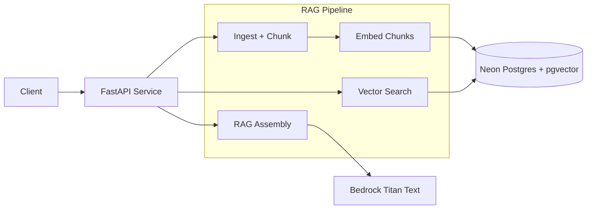

# Enterprise RAG Platform
A production-grade Retrieval-Augmented Generation (RAG) platform designed with AWS-native
components (Amazon Bedrock + Neon Postgres + pgvector + FastAPI).
## ■ Overview
This platform implements an end to end RAG workflow:  
- FastAPI backend exposing Chat, Search, RAG, and Ingestion APIs  
- Amazon Bedrock Titan Text for LLM responses  
- Amazon Bedrock Titan Embeddings for semantic embedding generation  
- Neon Postgres + pgvector used as the vector database  
- Document ingestion (raw text + PDF/TXT uploads)  
- Chunking engine with overlap  
- Embedding pipeline with metadata  
- Vector similarity search (with optional document filtering)  
- Retrieval-Augmented Generation pipeline that injects context before calling the LLM  
## ■ High Level Architecture

## ■ Architecture Description  
Flow: Client → FastAPI → RAG Pipeline → pgvector → Bedrock Titan  
Included components:  
- Ingestion pipeline (PDF/TXT + raw JSON)  
- Text preprocessing + chunking  
- Embedding generation (Titan Embeddings)  
- Vector similarity search (pgvector)  
- RAG orchestration using retrieved context  
- Optional toggles for stubbed/fake LLM and embeddings  
- Health endpoints, stats, and debugging routes  
## ■ Project Structure  
src/  
api/ # FastAPI routes and Pydantic models  
core/ # Pipeline orchestrator, settings, file loader  
rag/ # Chunking + vector store logic  
llm/ # Bedrock LLM + Embedding clients  
scripts/ # Tools and smoke tests  
.env.example # Environment variable template  
requirements.txt # Python dependencies  
## ■ Environment Configuration
Example `.env` values:  
USE_BEDROCK_LLM=true  
USE_FAKE_EMBEDDINGS=false  
PERSIST_EMBEDDINGS=true  
BEDROCK_LLM_MODEL_ID=amazon.titan-text-lite-v1  
BEDROCK_EMBEDDING_MODEL_ID=amazon.titan-embed-text-v1  
DATABASE_URL=postgresql://:@/  
## ■ Vector Database Schema (pgvector)
CREATE EXTENSION IF NOT EXISTS vector;  
CREATE TABLE IF NOT EXISTS chunk_embeddings (  
document_id TEXT,  
chunk_id TEXT,  
chunk_index INT,  
embedding VECTOR(1536),  
text TEXT  
);  
## ■ API Endpoints
### Chat (LLM only)
POST /chat  
{ "question": "Say hello" }  
### Ingest + Embed  
POST /ingest_and_embed  
{ "document_id": "worldcup98", "text": "France won the World Cup in 1998." }  
### Search  
POST /search  
{ "query": "Who won in 1998?", "top_k": 5 }  
### RAG Chat  
POST /chat_rag  
{ "question": "Who won the 1998 World Cup?", "top_k": 5 }  
### RAG Chat with document scoped search  
(retrieve context only from that specific document)  
POST /chat_rag  
{  
  "question": "Who won the World Cup in 1998?",  
  "top_k": 5,  
  "document_id": "worldcup98"  
}  
### File Upload  
POST /ingest_file  
## ■ Technologies Used  
- AWS Bedrock — Titan Text + Titan Embeddings  
- FastAPI — high performance microservice framework  
- Neon Postgres — serverless Postgres  
- pgvector — similarity search on embeddings  
- Python — service + orchestration  
- Uvicorn — ASGI server  
- boto3 — Bedrock SDK  

## 🛡 Guardrails & Governance    

This project currently implements a lightweight guardrail layer and is designed to evolve toward
enterprise-grade governance.

### Current implementation  

- **Context-scoped RAG prompts**    
  The `/chat_rag` endpoint constructs prompts that explicitly instruct the model to
  answer *only* from the retrieved context and to say "information is not available"
  when the answer is not present. This reduces hallucinations and keeps responses
  tied to enterprise documents.

- **Bedrock safety filters**    
  When running on AWS Bedrock, the platform relies on the built-in safety behavior
  of the selected model (e.g., Titan, Claude) for basic content moderation.

- **Optional Bedrock Guardrails (configurable)**    
  The `LLMClient` is wired to support Bedrock Guardrails via environment variables:  

  - `BEDROCK_GUARDRAIL_ENABLED`  
  - `BEDROCK_GUARDRAIL_ID`  
  - `BEDROCK_GUARDRAIL_VERSION`  

  When enabled, the service attaches a `guardrailConfig` to Bedrock `InvokeModel`
  calls so that enterprise policies (PII redaction, topic restrictions, response
  style rules, etc.) can be managed centrally in AWS rather than hard-coded in
  the application.

### Enterprise extensions (future)

In a production deployment for a regulated environment (finance, healthcare, etc.),
this foundation would typically be extended with:

- Document-level classification and access control (RBAC / ABAC)
- More advanced PII and PHI detection using specialized services or NER pipelines
- Detailed audit logging of prompts, responses, and guardrail interventions
- Per-tenant isolation of vector stores and metadata
- Budget and rate limiting for LLM usage

The goal of this project is to stay close to these enterprise patterns while keeping
the implementation small and easy to understand for learning and demonstration purposes.
## ■ License  
MIT License  
## ■ Contact  
https://www.linkedin.com/in/sinead-c-5543b31/